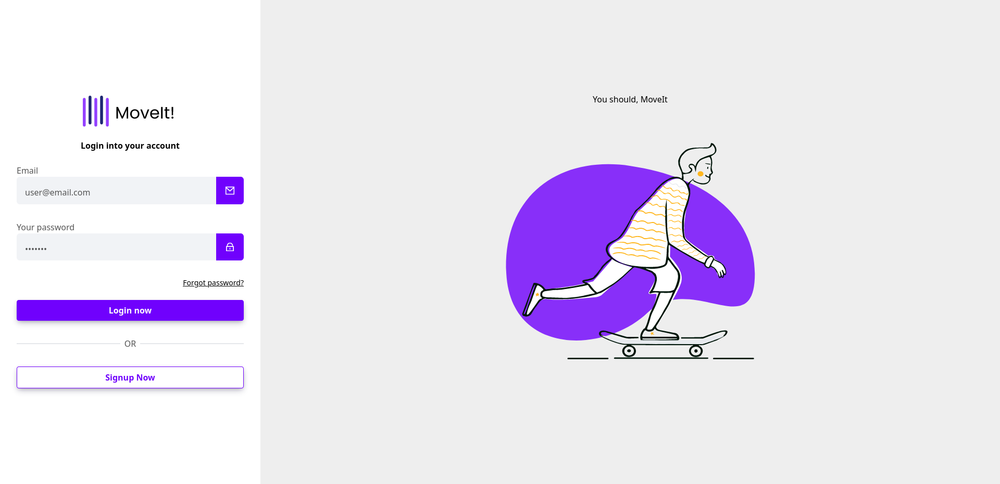
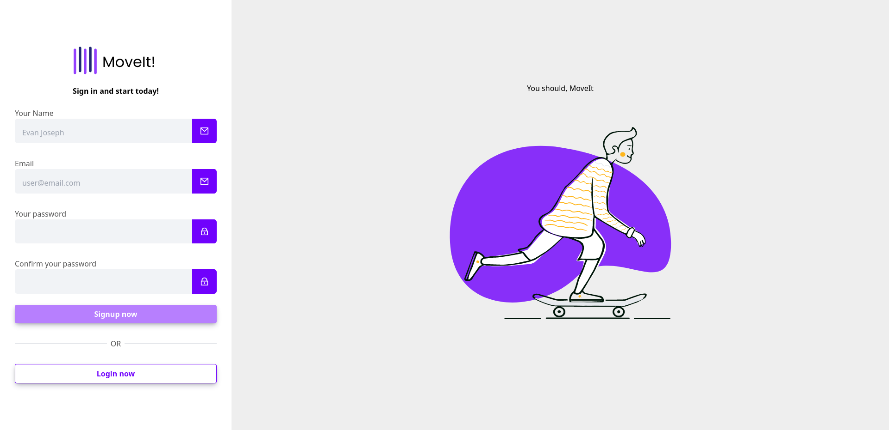

# Página de Login e Cadastro

Este é um projeto de página de login e cadastro desenvolvido com Angular e estilizado com Tailwind CSS. O objetivo deste projeto é fornecer uma aplicação web moderna e responsiva para autenticação de usuários.

## Funcionalidades

- **Autenticação de Usuário**: Os usuários podem inserir suas credenciais de login para acessar a aplicação.
- **Cadastro de Novos Usuários**: Os usuários podem se cadastrar fornecendo informações básicas.
- **Validação de Formulário**: Os formulários são validados para garantir que os usuários insiram informações corretas.
- **Responsividade**: A aplicação é totalmente responsiva e se adapta a diferentes tamanhos de tela.

## Estrutura do Projeto

O projeto está estruturado da seguinte forma:

## Como Utilizar

1. Clone este repositório para o seu ambiente local.
2. Certifique-se de ter o Angular CLI instalado. Caso não tenha, instale-o utilizando o comando `npm install -g @angular/cli`.
3. No terminal, navegue até a pasta raiz do projeto.
4. Instale as dependências do projeto utilizando o comando `npm install`.
5. Execute a aplicação Angular com o comando `ng serve`.
6. Abra um navegador da web e vá para `http://localhost:4200`.
7. Você verá a página de login e a página de cadastro.
8. Insira suas credenciais ou cadastre-se conforme necessário.

## Imagens do Projeto

Aqui estão as imagens da página de login e da página de cadastro:

- **Página de Login**:

- **Página de Cadastro**:

## Contribuição

Contribuições são bem-vindas! Sinta-se à vontade para fazer um fork deste repositório e enviar pull requests com melhorias, correções de bugs ou novas funcionalidades. Antes de enviar um pull request, por favor, abra uma issue para discutir as mudanças propostas.

## Licença

Este projeto está licenciado sob a [MIT License](LICENSE).
